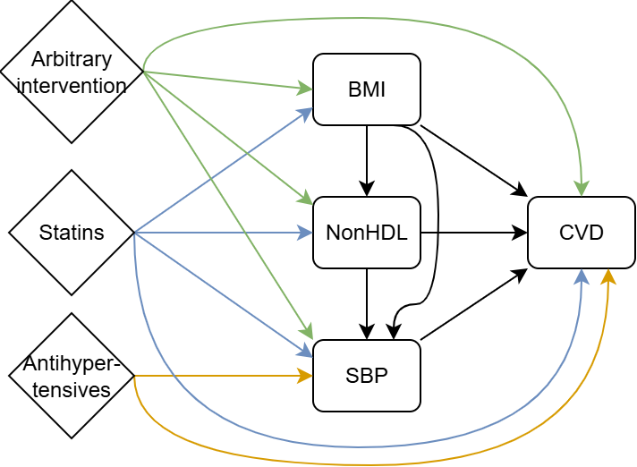

```{r setup, include=FALSE}
knitr::opts_chunk$set(echo=FALSE, message=FALSE, warning=FALSE, fig.width=10, fig.height=7)
knitr::opts_knit$set(root.dir = "../../")

library(ggplot2)
library(patchwork)
library(dplyr)
library(tibble)
library(matrixStats)
```

# Introduction

This document contains the results from a sensitivity analysis where we assume a pleiotropic effect for statins exists, meaning statins has a direct (protective) effect on cardiovascular risk.



During the estimation of the DAG (see supplementary material file 3), we found that the sum of the indirect effects through body mass index (BMI), non-HDL cholesterol and systolic blood pressure (SBP) was equal to the total effect of statins reported from a meta-analysis of systematic reviews. We are not claiming this provides strong evidence that there is no pleiotropic effect of statins, as the DAG was formed using data from a number of sources, which are not consistent with each other in terms of outcome/estimand. However, this did inform the decision to not include a pleiotropic effect of statins when building the two-component model (i.e. we assumed the direct effect of statins represented in the DAG, had no effect). In the main manuscript, we claim it is possible to include direct effects of interventions within the two-component model framework. Given there is evidence supporting the existence of a pleiotropic effect of statins, we implement a sensitivity analysis to showcase the inclusion of a direct effect.

In some situations, if the sum of the indirect effects does not match a reported total effect, it may be appropriate to estimate the size of a direct effect based on this information. However, in our case, the introduction of a direct effect will cause a disagreement between the total effect of statins as calculated from the DAG (sum of the direct and indirect effects), and the total effect as reported from an overview of systematic reviews.[@RN1351] There is no one size fits all approach for what to do when there is conflicting information supporting the derivation of the DAG. If some pathways are deemed to be based on information from lower quality sources, it may be sensible to derive the effect of these based off information from the stronger sources. In our example, the effect of statins on cardiovascular risk mediated by non-HDL cholesterol and SBP comes from high quality sources. The effect of statins on cardiovascular disease mediated through BMI comes from lower quality sources, but the effect is assumed to be very small. It would therefore be unreasonable to modify the effect of statins on cardiovascular risk mediated through BMI to account for the difference between the total effect estimated from the DAG and reported from the meta-analysis; however such an approach may be reasonable in other scenarios

Instead, we include the direct effect of statins without modifying the indirect pathways, and take note that this results in a total effect of statins that is too big compared to the gold standard, for the sake of this sensitivity analysis.
There is evidence indicating that statins has a pleiotropic effect on cardiovascular risk,[@RN1552; @RN1553; @RN1556] although there variation in the size of this effect. On the contrat, there are a number of studies indicating either no pleiotropic effect, or that have inconclusive findings.[@RN1555; @RN1551; @RN1550; @RN1554] Given the inconsistent evidence, we choose the a size of the direct effect purely as a sensitivity analysis. The size is chosen so that the total effect of statins on cardiovascular risk is 20% bigger than previously (on the hazard ratio scale), with all other effects in the DAG remaining the same.

We repeat the analyses from the main paper for the two component model, including model validation, and the worked example.

```{r helper-functions, include = FALSE}
# Calculate upper and lower CI from bootstrapped data
metric_ci <- function(boot_mat) {
  if (is.null(dim(boot_mat))) boot_mat <- matrix(boot_mat, nrow = 1)
  metric_boot <- boot_mat[, 1:3, drop = FALSE]
  colnames(metric_boot) <- c("ICI", "E50", "E90")
  tibble(
    metric = colnames(metric_boot),
    lower_ci = apply(metric_boot, 2, quantile, probs = 0.025, na.rm = TRUE),
    upper_ci = apply(metric_boot, 2, quantile, probs = 0.975, na.rm = TRUE)
  )
}

# Read in original data
read_original <- function(type, gender, model = 4) {
  if (type %in% c("ICI", "E50", "E90"))
    readRDS(paste0("data/calib_ph_", type, "_", gender, "_model", model, ".rds"))
  else if (type == "discrim")
    readRDS(paste0("data/discrim_", gender, "_model", model, ".rds"))
}

# Read in sensitivity analysis data
read_sens <- function(type, gender) {
  if (type == "smooth") df <- readRDS(paste0("data/sens_pleiotropic_calib_ph_df_smooth_", gender, "_model4.rds"))
  if (type == "grouped") df <- readRDS(paste0("data/sens_pleiotropic_calib_ph_df_grouped_", gender, "_model4.rds"))
  if (type %in% c("ICI","E50","E90")) df <- readRDS(paste0("data/sens_pleiotropic_calib_ph_", type, "_", gender, "_model4.rds"))
  if (type == "boot") df <- readRDS(paste0("data/sens_pleiotropic_calib_ph_CI_ICI_E50_E90_", gender, "_model4.rds"))
  if (type == "discrim") df <- readRDS(paste0("data/sens_pleiotropic_discrim_", gender, "_model4.rds"))
  return(df)
}

assemble_with_histogram <- function(main_plot, pred_vals) {
  # Create histogram
  hist_plot <- ggplot2::ggplot(tibble(pred = pred_vals), aes(pred)) +
    ggplot2::geom_histogram(ggplot2::aes(y = after_stat(density)), bins = 40,
                   fill = "grey80", colour = "grey40") +
    ggplot2::coord_cartesian(xlim = c(0,0.6)) +
    ggplot2::theme_bw() +
    ggplot2::theme(axis.text.y = element_blank(),
          axis.ticks.y = element_blank(),
          axis.title.x = element_blank(),
          plot.margin = margin(0,0,0,0),
          aspect.ratio = 0.25)

  # Set dimensions
  main_plot <- main_plot +
    ggplot2::coord_cartesian(xlim = c(0,0.6), ylim = c(0,0.6)) +
    ggplot2::theme(plot.margin = margin(0,0,0,0), aspect.ratio = 1)

  # Combine with patchwork
  (hist_plot / main_plot) + patchwork::plot_layout(heights = c(1,3))
}
```

# Model evaluation

It can be seen the model is well calibrated and there is no drop in performance compared to the model fitted in the main manuscript with no pleiotropic effect. This is to be expected, given the pleiotropic effect is relatively small.

```{r}
# Create gender vector and list to store plots
genders <- c(2,1)
plots <- list()

# Create plots
for (g in genders) {
  
  # Read in smooth and grouped data
  sm <- read_sens("smooth", g)
  gr <- read_sens("grouped", g)

  # Create plot
  p <- ggplot() +
    ggplot2::geom_line(data = sm, ggplot2::aes(pred, pred.obs), colour="black") +
    ggplot2::geom_point(data = gr, aes(pred, obs), colour="darkgreen", size=0.8) +
    ggplot2::geom_abline(slope=1, intercept=0, linetype="dashed") +
    ggplot2::theme_bw() +
    ggplot2::labs(title = ifelse(g==2, "Women", "Men"),
         x="Predicted risk", y="Observed risk")

  # Create histogram
  hist_pred <- sample(sm$pred, min(5000, nrow(sm)))

  # Create combined plot
  plots[[length(plots)+1]] <- assemble_with_histogram(p, hist_pred)
}

# Print plot
patchwork::wrap_plots(plots, ncol=2)
```

```{r}
# Create empty table
tbl <- tibble()

# Create table
for (g in genders) {
  # --- Calibration metrics ---
  est <- tibble(
    gender  = ifelse(g == 2, "Female", "Male"),
    metric  = c("ICI", "E50", "E90"),
    estimate = c(read_sens("ICI", g), read_sens("E50", g), read_sens("E90", g)),
  )
  ci  <- metric_ci(read_sens("boot", g))
  cal <- left_join(est, ci, by = "metric") |>
    dplyr::rename(value = estimate,
                  `lower CI` = lower_ci,
                  `upper CI` = upper_ci)

  # --- Discrimination ---
  d      <- read_sens("discrim", g)
  discrim <- tibble(
    gender     = ifelse(g == 2, "Female", "Male"),
    metric     = "C_index",
    value   = d[["index"]],
    `lower CI`   = d[["index_lower"]],
    `upper CI`   = d[["index_upper"]],
  )

  tbl <- bind_rows(tbl, cal, discrim)
}

# Round
tbl <- tbl |> mutate(across(where(is.numeric), round, 3))

# Print table
knitr::kable(tbl)
```

# A worked example

We consider the same individuals from the worked example in the main manuscript. We compare predicted risks under the statin intervention from the model with the pleiotropic effect, with predicted risks from the model used in the main manuscript (no pleiotropic effect). 

At visit 0, we estimate risk if we don't intervene, and risk under statin treatment. We then consider visit 1 (1-year later). At follow-up visit 1, we estimate the updated risk if we had not intervened. We then compare two further scenarios. The first is where statins has achieved an expected reduction in each of the modifiable risk factors (referred to as 'statins effective' scenario). The second, is where statins has had no effect on the modifiable risk factors (referred to as 'statins ineffective' scenario). This highlights the key difference between the two models, as the pleiotropic model still shows a benefit of the intervention at follow-up visit 1, even when statins have had no effect on the modifiable risk factors, whereas the original model does not. We can also see when statins does have the expected impact on the modifiable risk factors ('statins effective' scenario), the predicted risks under the pleiotropic model are lower, due to the added direct effect of statin use on cardiovascular risk.

```{r}
we_tbl <- tibble(
  scenario = c(
    "Visit 0: Do not intervene",
    "Visit 0: Risk under statin intervention",
    "Follow-up visit 1: Risk if we hadn't intervened",
    "Follow-up visit 1: Risk based on achieved modifiable risk factors (statins ineffective)",
    "Follow-up visit 1: Risk based on achieved modifiable risk factors (statins effective)"
  ),
  original_risk = c(
    readRDS("data/sens_pleiotropic_pred_visit0.rds"),
    readRDS("data/sens_pleiotropic_pred_visit0_statins.rds"),
    readRDS("data/sens_pleiotropic_pred_visit1.rds"),
    readRDS("data/sens_pleiotropic_pred_visit1_statins_uneffective.rds"),
    readRDS("data/sens_pleiotropic_pred_visit1_statins_effective.rds")
  ),
    pleiotropic_risk = c(
    readRDS("data/sens_pleiotropic_pred_visit0_pmodel.rds"),
    readRDS("data/sens_pleiotropic_pred_visit0_pmodel_statins.rds"),
    readRDS("data/sens_pleiotropic_pred_visit1_pmodel.rds"),
    readRDS("data/sens_pleiotropic_pred_visit1_pmodel_statins_uneffective.rds"),
    readRDS("data/sens_pleiotropic_pred_visit1_pmodel_statins_effective.rds")
  )
) |> mutate(original_risk_percent = round(100*original_risk,2),
            pleiotropic_risk_percent = round(100*pleiotropic_risk,2))

knitr::kable(we_tbl[,c("scenario","original_risk_percent","pleiotropic_risk_percent")],
             col.names=c("Scenario","Risk original model (%)", "Risk pleiotropic model (%)"))
```

# References